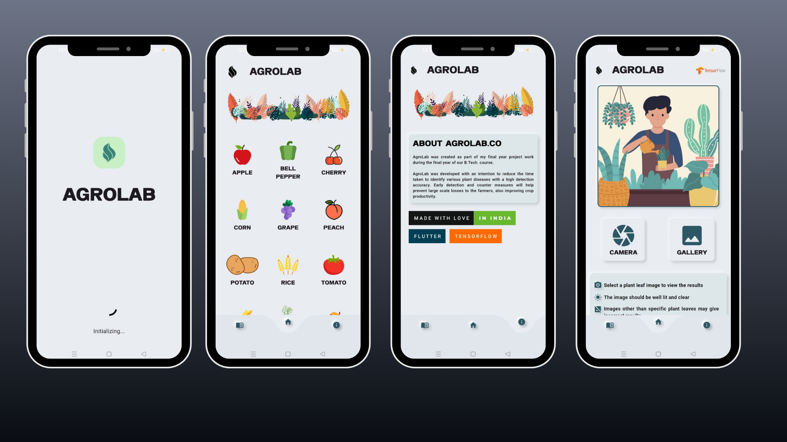

 

# **AgroLab**

---

   `Crop Disease Detection App`
   
 Agriculture apps can be very helpful in detecting crop diseases. With a quick scan from the camera or gallery, the app can provide the user with the latest articles on the agriculture world. Additionally, and provide tips on how to prevent it from happening. pictures, and videos related to the disease. This can help the user to make the best decision for their crops, and help to keep them healthy. this will prevent dead stock nad lose with some prevention measure can be taken. we aim for educating farmer and supporting the agrotech , for better future  
###

---

## Release (soon)

|   | APK  |   |
|---|---|---|
|   | FLATPACK  |   |
|   | EXE   |   |
|   | IPA   |   |

---

## UI/UX 

---

## Setting Up

